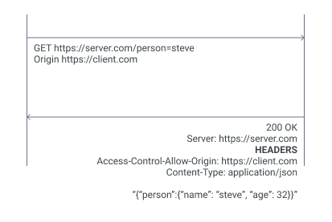
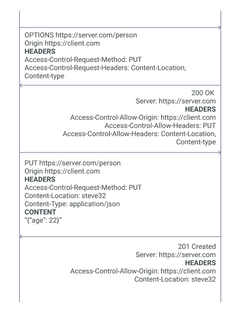
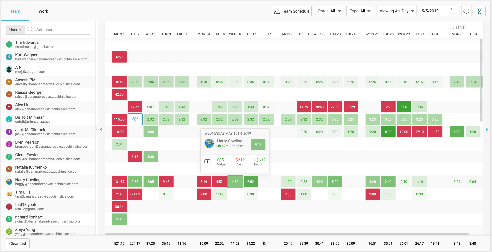
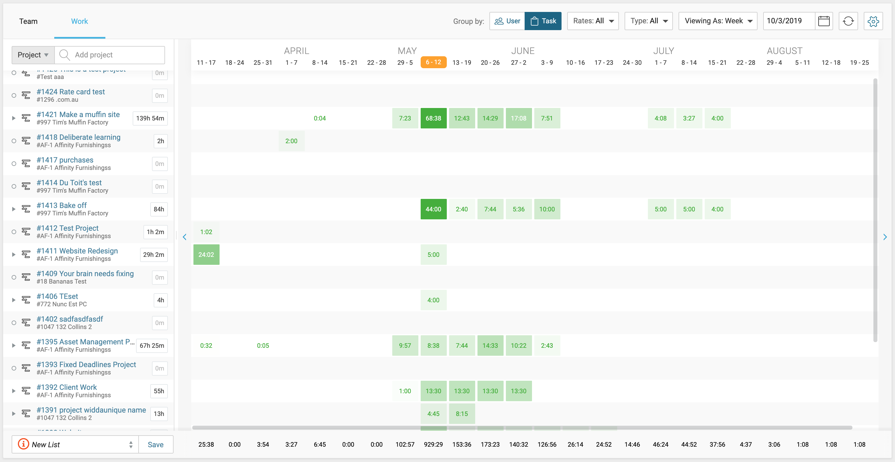
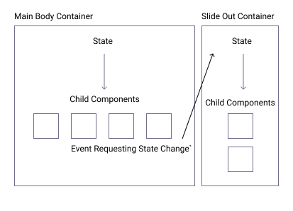
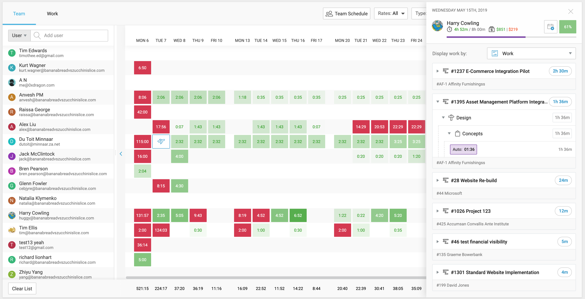
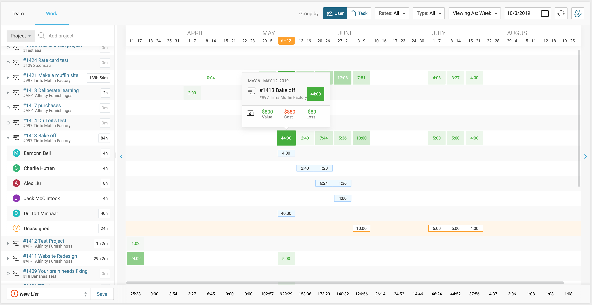
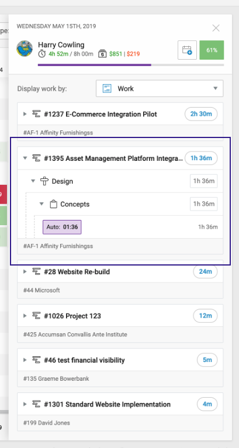

## Q1. What is the benefit of using a library like React/Vue/Angular vs using plain old JavaScript? What is your experience level with one of those frameworks?

### Benefits
As an analogy when building a house a builder probably won't begin by making their own bricks or PVC pipes. Likewise, a developer might choose a web framework because it provides some of the standard building blocks of a web application.

When you choose to use a framework over plain javascript you are choosing to hand over some architectural decisions to that framework. Different frameworks include varying amounts of architectural decisions, whatever framework you choose you are choosing some level of abstraction. The abstraction layer that most frameworks provide, with the help of compilers allow for some "syntactic sugar" such as vue's `.vue` files and reacts JSX.

Most frameworks come with opinionated ways of doing common tasks, hopefully allowing developers to spend less time on the infrastructure of their application and more time in the problem domain of the application. Depending on the framework, it might improve code quality because by reducing visible complexity in your code (the framework might be complex but you don't need to know) making the code you write simpler and easier to reason about.

In the frameworks that focus on the view layer (react, vue) one of the main advantages is keeping your data in sync with the DOM (data binding) and doing this syncing in a performant way with [virtual DOM diffing](https://www.codecademy.com/articles/react-virtual-dom). Frameworks with wider scopes like Angular2+ come with more architectural decisions already made for you such as routing, data flow, and helper functions for common tasks.

### Experience level with one framework (AngularJS)
Estimations of my experience levels AngularJS: 9.5/10

As most of our frontend code at Accelo is written in AngularJS and because I work for Accelo full-time it is the framework I am most experienced in, maybe that is not ideal for future job prospects... because its not a framework that would likely be chosen for newer projects. 

I am appreciative of my time with AngularJS and there are ways of architecting your code that makes it feel more modern, we have spent time putting style guides together to help us write maintainable code with AngularJS and avoid some bad practices. At Accelo we are currently working on deciding on if we want to migrate away from AngularJS, so far its been interesting to experiment with adding other frameworks to our application and seeing how we can make them work with AngularJS.

### Other Framework Experience Levels
React 8/10

My experience with React comes from some internal projects at Accelo and some freelance websites built using [GatsbyJS](https://www.gatsbyjs.org/).

Vue 6/10

My experience with Vue currently is only with my personal website. I enjoyed the small amount of time I have spent with Vue and I think it will be very easy to pick up for me since it has a heavy AngularJS influence (and the docs are great!).

Elm 6/10

My experience with Elm comes from a side-project I am working on, having a lot of fun with it. Elm is different in that it compiles to JavaScript, but it still is comparable to other frameworks.

## Q2. When is CORS needed and how does it work in the browser?
### When is CORS needed?
Cross-origin resource sharing (CORS) is a web standard for communicating with servers in a different origin then the original HTML page was served from. Using the CORS standard servers can specify what other origins can have access to a particular resource, and as we will see in the preflighted example below the server can also communicate what HTTP methods and headers can be requested from a particular origin.

There was an assumption in the early days of the web that websites would not need to load resources from other origins and doing so was a security risk. CORS has become a standard as a response to developers working around the cross-origin restriction with JSONP because loading resources from other origins become a useful pattern. Some of the benefits include having to host your own fonts, loading analytics tracking and images. CORS gives web servers fine-grained control over what origins are allowed to access resources and the shape of those requests.

For the following examples, we will be using these names for origin and cross-origin server 
Current origin: `https://client.com` - The origin the initial page was loaded from
Cross-Origin Server: `https://server.com`

### How does it work in the browser?
#### Simple Request
There a few [characteristics of a request that will make it a "simple request"](https://developer.mozilla.org/en-US/docs/Web/HTTP/CORS#Simple_requests). For example, in the diagram below we are using a GET method which could be a "simple request". 



The request is sent to the cross-origin server using the HTTP method GET. If successful the server will respond with the header "Access-Control-Allow-Origin" with a value of * or `https://client.com`. If the header has either of those values the response should already contain the requested content. The requested content, in this case, was some JSON data.

##### Note on Access-Control-Allow-Origin Header
```
Access-Control-Allow-Origin: *
```
Denotes that the server can request can be sent/received from any origin
```
Access-Control-Allow-Origin: `https://client.com`
```
This would mean that the request can only come from `https://client.com`. Whitelisting servers might be useful for origins that you control but are under different domains for organizational reasons.

#### Preflighted Requests
Requests that require the use of HTTP methods [other than the ones allowed in "simple requests"](https://developer.mozilla.org/en-US/docs/Web/HTTP/CORS#Preflighted_requests) will require a "preflight" request which involves additional round trips to the cross-origin server to confirm available methods before the requester can proceed with the desired HTTP request method. Requests will also be preflighted by the browser if the headers contain any other headers then the ones automatically set by the client, these additional headers will also need to be confirmed by the cross-origin server before proceeding with the real request.



Preflighted request responses will be cached to reduce the multiple round trip times for subsequent requests. Caching time is controlled by the remote server by sending an Access-Control-Max-Age header containing the amount of time the browser can cache the preflighted response without asking for another.

## Q3. What is an XSS attack? Explain what can lead to one and how can it be prevented?

### What is an XSS attack?
Cross-Site Scripting (XSS) is a security exploit in browsers that enables an attacker to inject malicious code within a web page. When the malicious javascript is running it is able to access anything that any other javascript can including cookies, session tokens, any information already on the page and can even prompt users for new information.

### What can lead to one
For an XSS attack to occur a developer must build into a website a way to inject HTML content without sufficient validation or encoding, which unfortunately can be easy to accidentally do.

For example in a chat application where users can send each other text (string) messages the application might print the message from user1 to *user 2*. If *user 1* were to send *user 2* text that looks like HTML `hi<script>console.log('hi')</script>` and then application adds the text message in a unsafe way using `HTMLElement.innerHTML` the script will be executed because the text message from *user 1* was valid HTML. This could be a form of a [stored XSS attack](https://developer.mozilla.org/en-US/docs/Glossary/Cross-site_scripting) because most likely this chat application will store users messages in a database and then every time the chat is loaded the same HTML will be injected into the page.

When this might be considered an attack is when the script does something malicious such as prompting *user 2* for sensitive information or sending off all of *user 2*'s activity to a remote server (and even taking advantage of CORS to do so). Once the script is running on a page it has full access to anything within the page.

### How it can be prevented
#### Escaping
Escaping involves turning characters into encoded versions that the browser won't confuse for HTML '>' turns into '&gt;'. Escaping should be done before inserting any un-trusted data into a web page, there are even cases where [scripts can run in style/CSS blocks](https://github.com/OWASP/CheatSheetSeries/blob/master/cheatsheets/Cross_Site_Scripting_Prevention_Cheat_Sheet.md#rule-4---css-escape-and-strictly-validate-before-inserting-untrusted-data-into-html-style-property-values) therefore you want to not only encode dynamic un-trusted HTML, but also CSS and JS.
#### Sanitizing
Sanitizing involves stripping content for potentially exploitable characters in the text. For example, removing specific HTML tags `<script>` before including any un-trusted content on your web page. Sanitizing is useful when a web page needs to allow dynamic user-created HTML, CSS, JS to display on a page. When using a sanitizer it is safer to use a whitelist to allow the content you want rather than using a blacklist to ban bad content because blacklisting involves having to know all the potentially exploitable content, although whitelisting is more restrictive.

## Q4. Tell us about your latest "hard to debug" problem. How did you resolve it? Which tools did you use?
At Accelo we have a custom event messaging system, it is used to broadcast messages to any configured event listeners within the application.

To configure an event listener you can set up a callback with an associated string key
```js
on('task-shortcut-pressed', function openTaskPopup(Id, title) { /* do things... */ })
```

To trigger an event an *eventKey* is used as the first param, any additional arguments are passed into the callback function registered in **on**
```js
trigger(/* eventKey */'task-shortcut-pressed', /* Id */ 187 , /* title */ 'my new task')
```

Now to the problem, sometimes when pressing the shortcut to open the task popup ('T' on the keyboard) it would open the popup multiple times, and the popups would appear on top of one another. It was not a great user experience but it did not prevent users from creating tasks, we did not consider it a critical bug because from some analytics data we knew that the shortcut was rarely used, knowing this it gave me some time to do some debugging and find the root cause.

This problem was "hard to debug" because it would not appear consistently every time the shortcut was pressed. I had to first identify a reproducible set of steps to trigger the bug within the browser before I could begin diving into the code.

Once I had a set of reproducible steps, it was time open up the chrome dev tools. The first attempt at debugging this problem was to add a couple of breakpoint in the dev tools in our **popup manager** (don't want to go into this now, but it is a singleton that controls what popups are appearing on screen) and it was clear the popup was being triggered multiple times but the source of the problem did not seem to be there. The popup manager has some code that was meant to prevent this duplication, but it seems it was not working either. Although I could have solved the problem here I knew this was not the root issue, so I created a note for myself to come back and fix the popup manager issue and kept digging.

From a call-stack within a breakpoint in the **on** callback, I could see that there were multiple calls from the "keyup" browser event. Opening the 'event listeners' tab in the dev tools then revealed that there were multiple "keyup" event listeners being registered from the same location in our code. Now it was time to go digging into where the "keyup" listener was registered.

### What I found in the existing code
For some events, we have special setup functions that are called when the first **on** callback is registered for a specific event key.
```js
const eventSetups = {
    'task-shortcut-pressed': () => {
        window.addEventListener('keyup', event => {
            if (event.key === 'T') }
                trigger('task-shortcut-pressed');
            }
        }),
    },
}
```

The **on**, **trigger**, **off** functions all share some state which is the registered event listeners for particular keys.
```js
const registeredEventListeners = {
    'task-shortcut-pressed': [callback, callback, callback]
} 
```
There callbacks are all function references.

When the first callback for an event key is registered using **on** the setup is called.
```js
function on(eventKey, callback) {
    // Run the setup for eventKey if this is the first callback for this eventKey
    if (registeredEventListeners[eventKey] && registeredEventListeners[eventKey].length === 0) {
        eventSetups[eventKey] && eventSetups[eventKey]();
    }

    registeredEventListeners[eventKey].push(callback);
}   
```

The **trigger** functions will run all of the callbacks when it is ran.
```js
function trigger(eventKey, ...params) {
    registeredEventListeners[eventKey].forEach(callback => callback(...params));
}
```

There is also an **off** function for unregistering events, this function removes callback function references.
```js
function off(eventKey, callback) {
    registeredEventListeners[eventKey] = registeredEventListeners[eventKey].filter(registeredCallback => registeredCallback != callback);
}
```

Can you see where the bug was? In the event that all of the events were unregistered for "task-shortcut-pressed" the setup function would then be called again once another **on** event was registered.
```js
const callback = () => openPopup();

// Internally ON function now runs the setup for this event which includes running window.addEventListener('keyup', ...)
on('task-shortcut-pressed', callback);

// Another event is registered under the same event key. The setup is not ran again
const callback2 = () => console.log('popup probably opening');
on('task-shortcut-pressed', () => callback2);

// Both callbacks are unregistered
off('task-shortcut-pressed', callback);
off('task-shortcut-pressed', callback2);

// This now is where the bug lies. When the next ON callback is registered for the same event key. the setup function will run again. Setting up another window.addEventListener('keyup', ...)
on('task-shortcut-pressed', () => console.log('popup is going to open twice... (╯°□°）╯︵ ┻━┻'));

// In this case, the next time 'T' is pressed on the keyboard the registered ON callbacks will be called twice.
trigger('task-shortcut-pressed');
```
*side-note:* This was a similar test pattern that I used for writing up a unit test after I solved this bug.

This bug had gone unnoticed for many years because we had not come across this particular situation before where both of these conditions had to be true
1. The setup event had to include another event registration. In this case, it was the usage of addEventListener.
2. There had to be a state of the page that resulted in all of the event callbacks being unregistered with **off** then again registered under the same eventKey with **on**.

### The Fix
To fix this problem I extended the setup configuration object to include both a *setup* and *teardown* method for each event key.
```js
const eventSetups = {
    'task-shortcut-pressed': (() => {
        // IIFE used for scoping
        const onKeyUp = event => {
            if (event.key === 'T') {
                trigger('task-shortcut-pressed');
            }
        };

        return {
            setup: () => {
                window.addEventListener('keyup', onKeyUp),
            },
            teardown: () => {
                window.removeEventListener('keyup', onKeyUp)
            } 
        }
    })(),
}
```

Then within the **off** function, we call the teardown function when there are no more event listeners for that eventKey. The **on** function was extended in a similar way to call `.setup()`.
```js
function off(eventKey, callback) {
    registeredEventListeners[eventKey] = registeredEventListeners[eventKey].filter(registeredCallback => registeredCallback != callback);

    if (!registeredEventListeners[eventKey].length) {
        eventSetups[eventKey].teardown();
    }
}
```

Now next time the **on** function runs another setup during the same page session, the original addEventListener should have been unregistered. Next up I added some unit tests for my new code and the bug was history.


## Q5. Tell us about your most advanced/exciting/mind-blowing JS/CSS implementation
One of my most *advanced* JS/CSS implementation was the "Schedule Dashboard" in Accelo. I was the frontend lead for this project.

The page has two modes to display data:

**TEAM** mode visualizes the amount of work each team member has relative to their work hours/days with the objective of allowing a manager to see who is under-worked or overworked and relocate work appropriately.



**WORK** mode visualizes the amount of time each project has allocated to it, aiming to give a manager the ability to identify projects that are under or over-resourced and allocate resources appropriately. 


### Much Data
The page can potentially load large amounts of data which translated to many angular components on the page at one time. Each square (as seen screenshots above) was a component that does some of its own calculations once it gets data passed into its props/bindings, this component architecture caused major slowdown during re-renders after data changes and during any angular digest.

An angular digest cycle can happen after any browser event. If many data listeners are set up (which most components have a few each), angular will do "dirty checking" meaning it checks every potential data point for changes on each of these components to determine if it needs to re-render the component.

Due to time constraints, we decided that the best method to solve this performance issue was to patch it by paginating data to avoid many components on the screen, the number of components on the screen was constrained by the current browser width.

The page remains in this patched state today (it was built at the end of 2017) because it is working well enough for our customers and we had to move on to other projects. If we were to revisit this screen I would like to look into a using a form of [virtualized list](https://github.com/bvaughn/react-virtualized) to avoid having the pagination and allowing users to scroll limitlessly (e.g. the offscreen components would not set up event listeners and possibly not render until they are scrolled into view). Another improvement may be to do the calculations that each cell was doing upfront before it is passed into each component.

### Component Structure
The components on this page are very loosely coupled which had a few benefits. During development it allowed each developer to work fairly independently from one another and then plug our work into one another at the end. We wrote down some data contracts between the components to make the process of plugging the components together seamless because each component had well-defined inputs/outputs.

Another benefit of these loosely coupled components is the ability to iterate and extend/modify the page. When changing one component on the screen you can be fairly confident that the change will not affect the rest of the page.

We broke down the page into a few container components that maintained the state for the rest of the page. These container components then contained many child components that were view/functional only and did not have their own state. Messaging between components was used to change the state when needed across different containers.



For example, clicking on a square in the body of the page would send a message to the container component that controlled the popover


### Flat Data Structures
We chose to use flat data structures to simplify the rendering of DOM content to make our code easier to read and maintain. While the data structures were flat the UI appeared nested for the users of the schedule dashboard. Most of the UI on this page has a nested structure to it allowing users to keep expanding nested data.



### Synchronised Scrolling Panes
The scheduling dashboard consists of three panes that can move independently of one another. These panes needed to be kept in sync, when the body scrolled vertically the left navigation needed to scroll when the date header scrolled horizontally the body needed to scroll etc. To pull this off I quickly realized a problem when one pane would receive a scroll event, it then would trigger scrolling on another pane that would then trigger scrolling on another pane, and this would eventually lead to a stack overflow.

The solution here was to register scroll event listeners for each pane as the user triggers a mouseenter event, then unregister the scroll event as the user triggers a mouseout event on that pane. This solved the infinite loop issue. 

### Unit testing
Upfront we decided to add unit tests for data generation, but not for UI during prototyping stages. The reason being is that the UI was still in a prototype phase and big changes were likely to be made. We came back later and added unit tests for the important UI functionality once the UI changes were more stable.

### Lessons Learnt
This project at Accelo has influenced the way we have built future projects ever since. Some of these lessons include
- Prototyping to test assumptions 
- Breaking down work into small chunks (or phases) to get something working asap
- Using a similar pattern to [git flow](https://www.atlassian.com/git/tutorials/comparing-workflows/gitflow-workflow) for managing changes
- Using written data contracts to allow developers to work independently

### Where is the Mind-blowing CSS?
The most interesting CSS implementation in this project was maintaining the nested (accordion-like) user interface while maintaining a flat list data structure in the code. This was through having an "indentation level" property on each row in our data model, then in the row components creating dynamic CSS values for the `margin-left` to make it appear nested.



One thing that needs improving is the dashed lines appear to have a double length dash where each row meets, oops!
